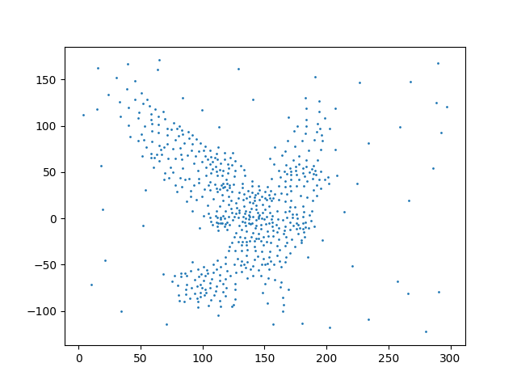
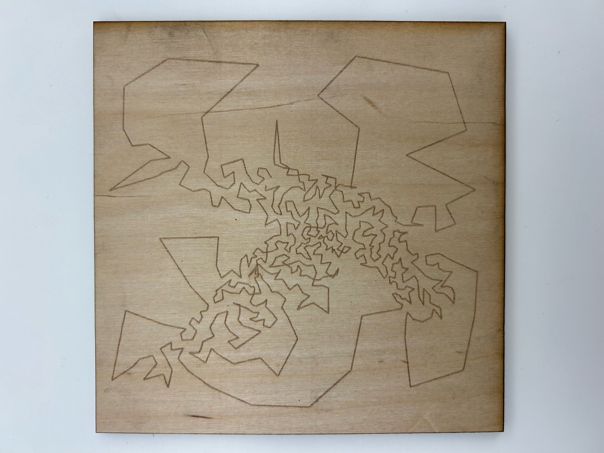
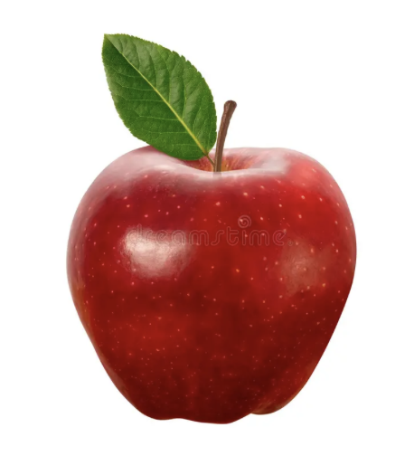
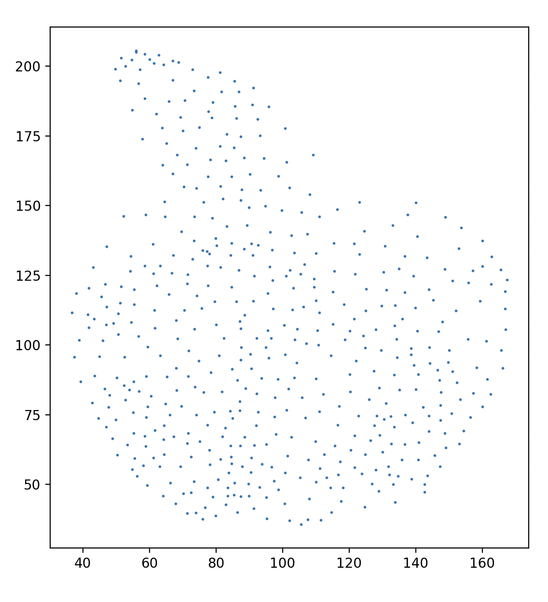
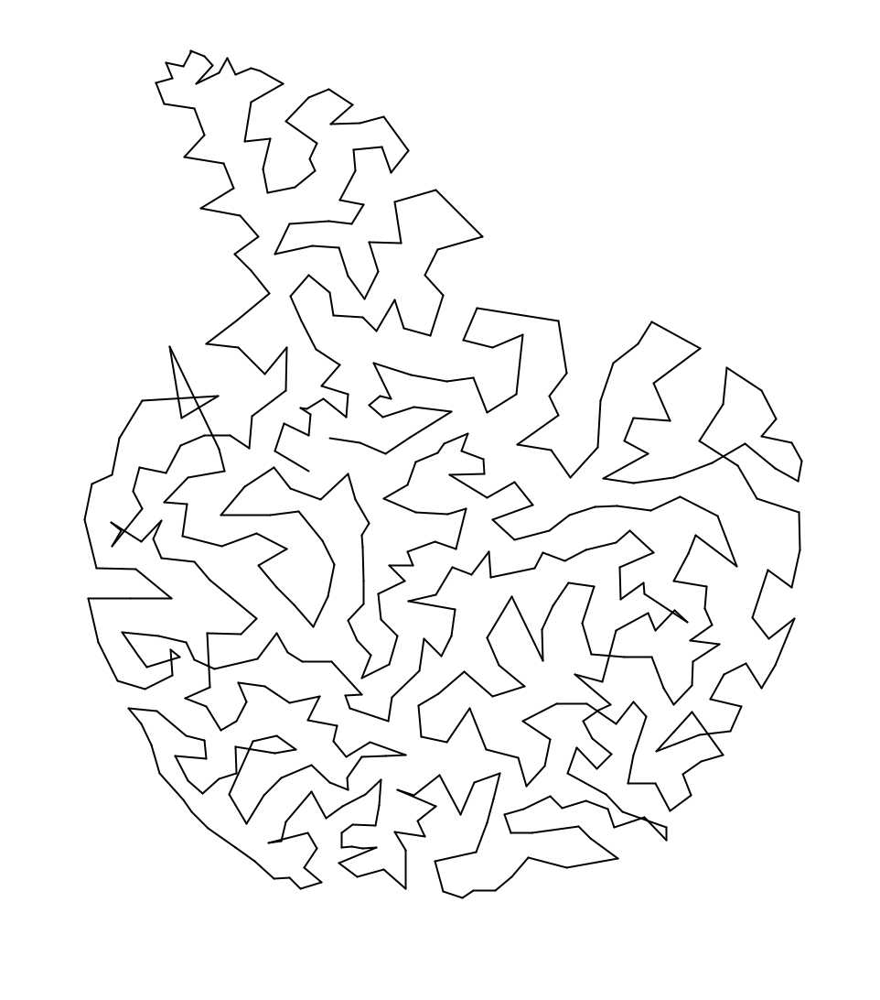

### Final Report (12/5/2025)
The code for the `Stippling` class, the main class that performs the algorithms described below, can be found [here](https://github.com/melodyhsu47/CompFab-2025/blob/main/stippling.py).
The main driver code can be found [here](https://github.com/melodyhsu47/CompFab-2025/blob/main/image_processing.py).
The Processing code that generates the final lines can be found [here](https://github.com/melodyhsu47/CompFab-2025/blob/main/path_drawing.pde).
The aim of this project is to reproduce any input image of any format as an image drawn from a single, continuous line.
The output is generated using a two-step process which is written in a combination of Python and Processing.
The final output is intended to be laser-etched into a laser-safe material.

This project takes direct inspiration from [Opt Art: From Mathematical Optimization to Visual Design by Robert Bosch](https://press.princeton.edu/books/hardcover/9780691164069/opt-art?srsltid=AfmBOorkFsOVZK2vYG8Cq-LrHTIinf0wXhaYH9N-rWbcWdj1vdR3eEOt).
In his book, he provides an overview of how he generates the below images (without explicitly providing code); the code that I wrote is an implementation of the process he describes.

#### Implementation details
See the mid-progress report for details on the implementation.
The code remains similar.

#### Example usage
Usage is very simple and all wrapped into the `Stippler` class.
The only parameters the user needs to pass in are `img_width`, the width (in pixels) of the image to be drawn, and `num_points`, the number of stippled points.
```
filepath = '/Users/melodyhsu/Desktop/bird.jpeg'
img_width = 300
num_points = 600

s = Stippler()

greyscale_image = s.process(filepath,img_width)
stippled_points = s.macqueen(greyscale_image,num_points)
path, _ = s.tsp_path(stippled_points)

np.savetxt("path_drawing/points.csv",stippled_points,delimiter=',',fmt='%.3f')
np.savetxt("path_drawing/path.csv",path,delimiter=',',fmt='%d')
```
The files `points.csv` and `path.csv` contain coordinates in the XY-plane and the order of traversal, respectively, which are then passed into Processing.
The Processing program then joins the coordinates with lines in the visitation order specified by `path.csv`.

The user can also optionally visualize the stippled points below by adding the below lines to the driver code:

```
px = [p[0] for p in stippled_points]
py = [p[1] for p in stippled_points]

plt.scatter(px,py,s=1)
plt.show()
```
#### Visual output
As an example, the bird image, when stippled, looks like this:



The output from Processing looks like this:




### Mid-Progress Report (11/16/2025)
The ultimate goal of this project is to write a script that will take any image and create a single-stroke rendering of it.
This process occurs through two main (algorithmic) steps: (1) the image is converted to a series of stippled points, with a higher density of points in darker areas of the image; and then (2) the points are joined using a TSP traversal.
The outputted image can then be etched via laser-cutting onto a laser-safe surface.

### Current functionality (11/16/2025)
Steps (1) and (2) are currently demo-ready, though both still have to be refined for additional flexibility and ease from an end-user perspective.

#### Step 1
The conversion from an image to point form is done in Python in a class called `image_processing.py`, which contains the following functions:
1. `process(imagepath,new_width)` - Takes an image as a filepath, converts to grayscale, and then downsizes. The downsizing is important in order for the point and path generation to take a reasonable amount of time; initial tests have been done by downsizing an image to 200 pixels in width. `process` returns a `PIL` image object, and the new image is saved to the project directory.
2. `macqueen(image,k,iters=5000)` - Takes a *processed* image (i.e., one that has already been converted to grayscale), and then creates a probability distribution based on the inverted RGB values of the greyscale image. Then, the point generation proceeds in two main steps: (a) $k$ points (as a pixel location) are generated according to the probability distribution and initialized with a "resistance" counter set to 0; and then, for 5000 iterations, (b) a new "tractor beam" point is generated from the same distribution, and the point from the set of $k$ points that is closest in Euclidean distance to the "tractor beam" point has its resistance counter incremented by 1, and its location adjusted to a weighted average of the tractor beam's location and its original location. `macqueen()` returns the modified points as a `numpy` array.
4. `tsp_path(points)` takes in an array of locations and then returns a *locally* optimal TSP traversal through the points as an array of indices indicating the order of visitation through `points`.

In the generation script, the end user calls these functions in order, passing in an image of their choice.
The end user then saves the array of point coordinates and the order of visitation as csv files, which are then imported into Processing for the image generation.

#### Step 2
In Processing, the user imports csvs holding the point coordinates and the order of visitation.
After reading in the lines of the point coordinates file, the coordinates are joined by lines according to the order of visitation.

#### Images
Below is the demo image, the (optional) output from step 1, and then the final output from step 2.





**Runtime**: Initial tests have been done with a resized image of 200 x 220 pixels, with 500 points and 5000 iterations of Macqueen's algorithm.
The whole process terminates in around 2-4 minutes from start to finish, with the vast majority of the time spent on step 1.
It is unlikely that step 1's runtime can be optimized much further, as even heuristic TSP computations are expensive.

**Performance**: One obvious flaw with the output is that there is a small number of crossings in the path.
This is likely because the TSP algorithm that I use is heuristic, so it doesn't achieve the true optimal distance.
It would likely take much, much longer to generate a truly optimal visitation order, though definitely possible (and probably will be done for the final fabrication step to achieve a more aesthetically pleasing outcome).


