## Task 1: Creating shapes with Turtle

## Task 2: L-System base code
For all below L-systems except the probabilistic L-system, the code that dictates the Turtle's actions for each character in a string can be found [here](https://github.com/melodyhsu47/CompFab-2025/blob/main/LSystem.pde).
The code that dictates the Turtle's actions for each character for a probabilistic L-system can be found [here](https://github.com/melodyhsu47/CompFab-2025/blob/main/ProbabilisticLSystem.pde).

## Task 3: Custom L-Systems

### L-System 1: "Garden"
This L-System is a modification of the [Hilbert curve](https://en.wikipedia.org/wiki/Hilbert_curve) with slightly curved angles.
The code containing the production rules is listed under the function `initGarden()` in the [ExampleLSystemDesigns](https://github.com/melodyhsu47/CompFab-2025/blob/main/ExampleLSystemDesigns.pde) file.
Below are iterations for $n=1$ through $n=6$ (as the curve does not become visually interesting until higher $n$).

  
   

  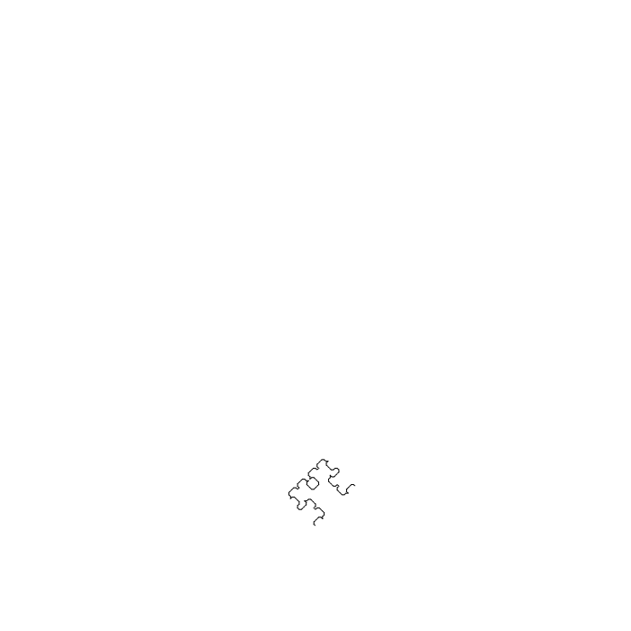
  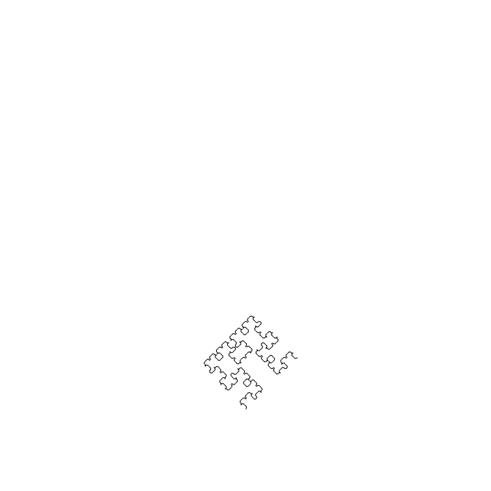 

  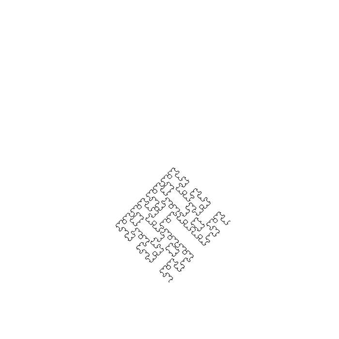
  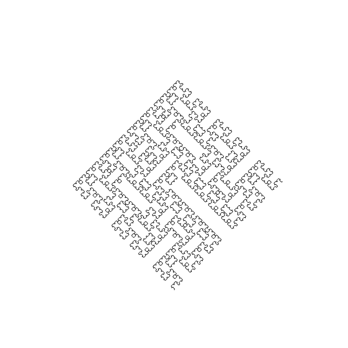

### L-System 2: "Tile"
This L-System is inspired by the [$n$-flake fractal](https://en.wikipedia.org/wiki/N-flake) and uses as its base a hexagon.
The code containing the production rules is listed under the function `initTile()` in the [ExampleLSystemDesigns](https://github.com/melodyhsu47/CompFab-2025/blob/main/ExampleLSystemDesigns.pde) file.
Below are iterations for $n=1$ through $n=4$.

  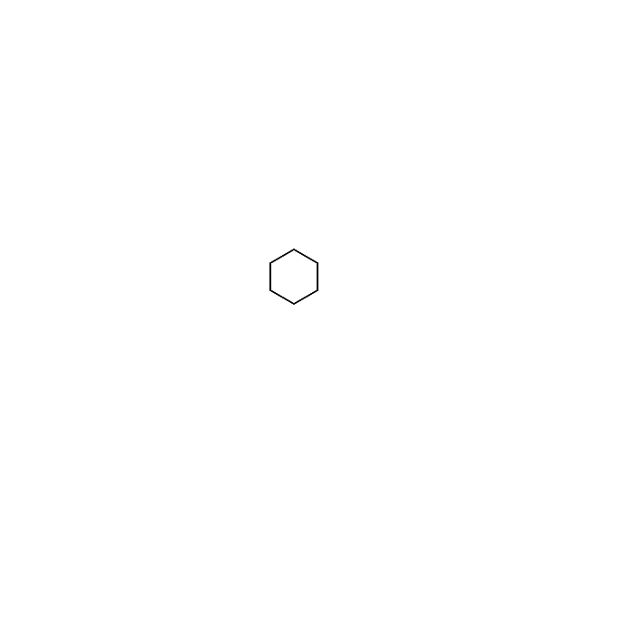
  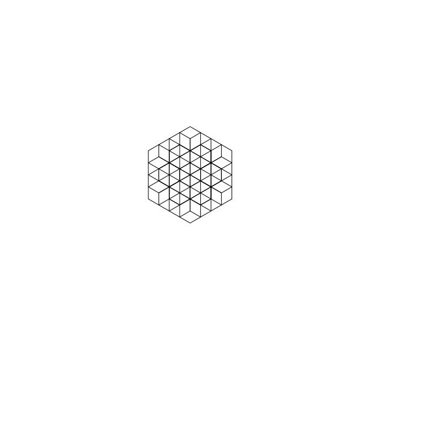

  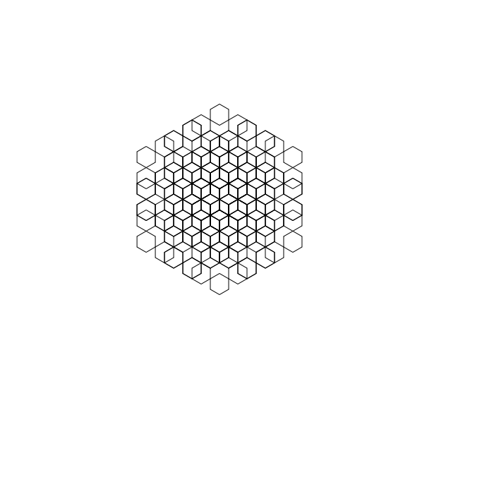
  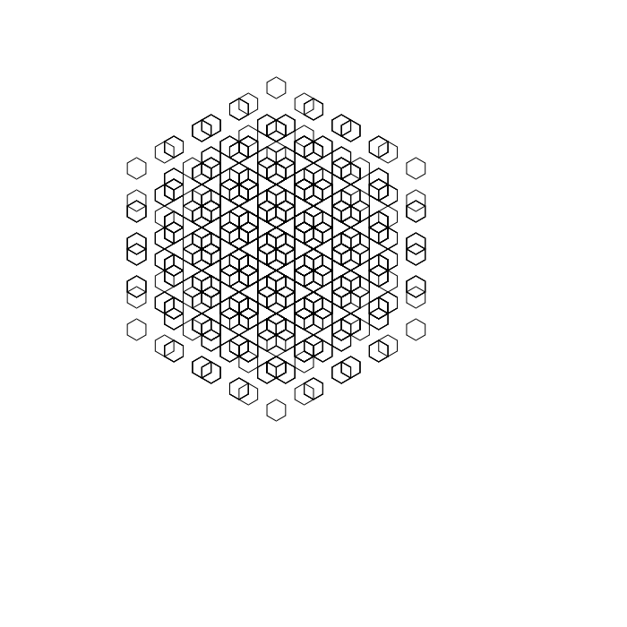

### L-System 3: "Maze"
This L-System is also based on the Hilbert curve and uses the "node-replacing" technique to generate a [FASS](https://en.wikipedia.org/wiki/Space-filling_curve) on a 4-by-4 starting grid.
The code containing the production rules is listed under the function `tile2()` in the [ExampleLSystemDesigns](https://github.com/melodyhsu47/CompFab-2025/blob/main/ExampleLSystemDesigns.pde) file.
Unfortunately, the curve is not fully self-avoiding or space-filling for reasons I don't fully understand.

  
  
  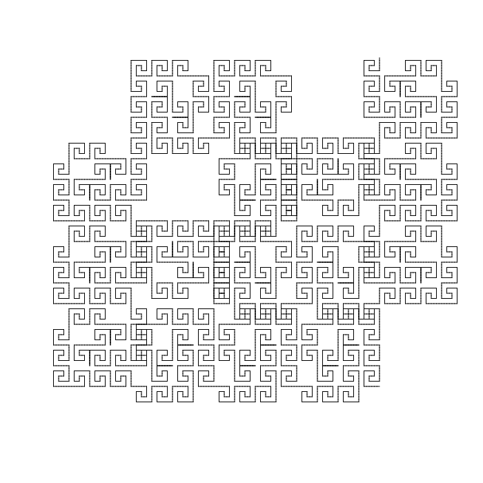

### Probabilistic L-System: "Plant"
This L-System uses a combination of probabilistic rule-following and probabilistic length and angle parameters.
At each iteration, the plant either grows the stem, a pair of leaves, or a "berry."
The angle of the leaves and the length of the stem can be random as well.
The code containing the production rules is listed under the function `plant()` in the [ExampleLSystemDesigns](https://github.com/melodyhsu47/CompFab-2025/blob/main/ExampleLSystemDesigns.pde) file.
In the below images, the center plant does not have random angle/distance variation, while the left and right plants do.

  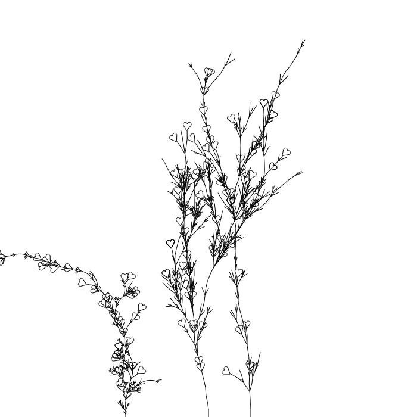
  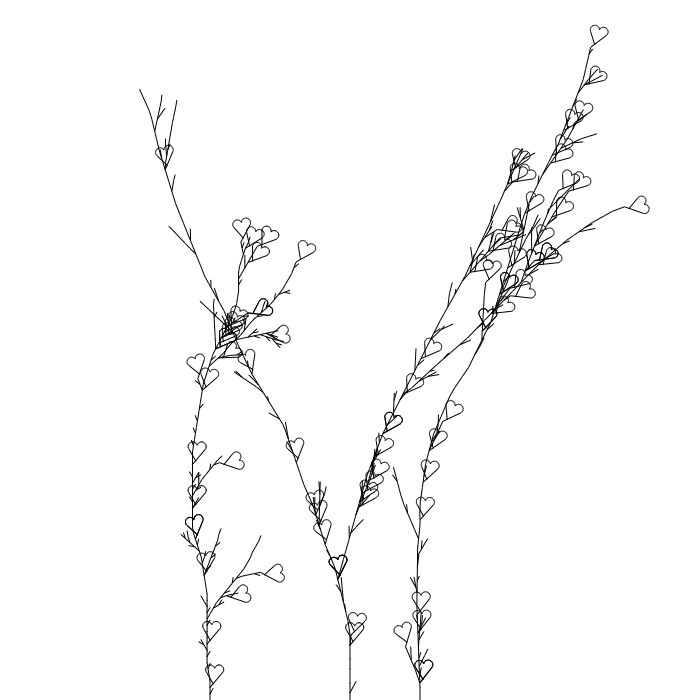
  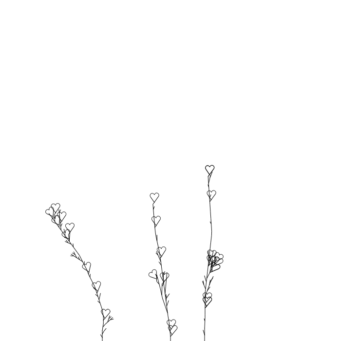

## Task 4: Images

