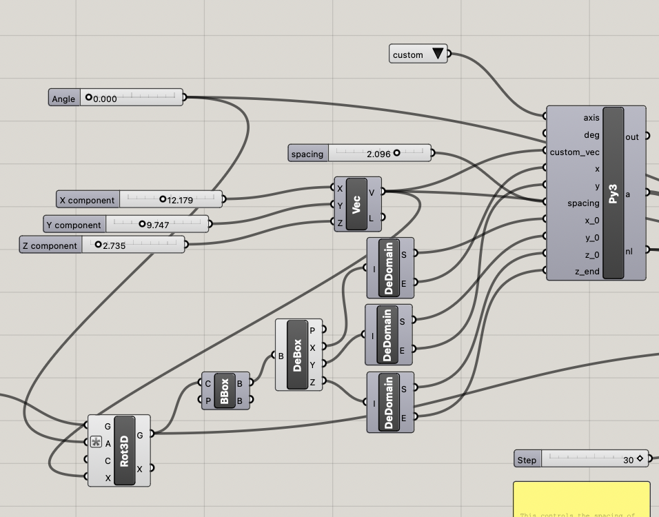

### Task 1: Parametric Generation
For this task, we have a form that is parametrized by the following customizable parameters:

1. $x,y,z$ coordinates of the form's location
2. Number of segments for base polygon
3. Number of segments for middle polygon
4. Number of segments for top polygon
5. Height of middle polygon (center curve)
6. Height of top polygon
7. Radii for all three polygons
8. $x,y,z$ coordinates of the decorative top sphere
9. Radius for decorative top sphere
10. $x,y,z$ coordinates of the control point for the curve through center of the form
11. Degree of bend of curve
12. Radius of extruded cylinder along curve

Below are five variations of the form.
<p float="left">
  
  
  
</p>

<p float="left">
  
  
</p>

### Task 2: 3D-to-2D Slicer
Below is the code snippet that generates the slicing planes that generate the 2D slices that intersect a 3D object.

```
import rhinoscriptsyntax as rs
import math

def make_layers(spacing,x,y,x_0,y_0,z_0,z_end,axis,custom_vec=None):
    rects = []
    num_layers = int((z_end-z_0)//spacing) + 1
    
    z_offset = 0
    x_offset = 0.5*x
    y_offset = 0.5*y
    print(custom_vec)
    deg = 0

    for i in range(num_layers + 1):
        p = rs.WorldXYPlane()
        p = rs.MovePlane(p,(x_0-x_offset,y_0-y_offset,z_0+i*spacing-z_offset))
        # code for custom plane angling is omitted here
        # [...]
        rect = rs.AddRectangle(p,2*x,2*y)
        rects.append(rect)
    return rects, num_layers+10

a,nl = make_layers(spacing,x,y,x_0,y_0,z_0,z_end,axis,custom_vec)
```
The python script computes the number of layers based on the height of the bounding box, given by $z_{end}-z_0$, which are the deconstructed endpoints of the z-axis component of the bounding box.
The spacing, i.e. the material thickness, is taken in as a user-defined parameter via slider.



Then, the next step is to get the curves for laser-cutting.
To do this, we use `BBX` to intersect the planes generated by the Python script and the parametric form.
Then, we map these curves onto distinct locations on the XY plane.
Finally, to print text onto the curves, we compute text baselines using the centroids and endpoints of each laser-cut curve, and then use `TexttoSrf` to place text on these lines.


A portion of the output is shown below.


### Task 3: Fabrication
Below are two examples of fabricated designs.

### Extra Credit: Part 1


