### Part 1
The full Grasshopper code, which is just referenced in parts below, can be found [here](https://github.com/melodyhsu47/CompFab-2025/blob/main/Melody_L3-3DPSlicerGcodeGenerator.gh).

#### Task 1: Creating the slicer
The custom slicer relies on a Python script to generate lines going in the y-axis spaced according to the Prusa MK4's specified extrusion width.

```
import numpy as np
import math
import rhinoscriptsyntax as rs
import ghpythonlib.treehelpers as th

def create_lines(x,y,spacing,z):
    # spacing is 1.2 * nozzle diameter
    layers = []
    heights = np.arange(0,z,0.3)
    xpoints = np.arange(x[0],x[1],spacing)
    for j in range(len(heights)):
        layer_lines = []
        for i in range(len(xpoints)):
            p1 = rs.AddPoint((xpoints[i],y[0],heights[j]))
            p2 = rs.AddPoint((xpoints[i],y[1],heights[j]))
            l = rs.AddLine(p1,p2)
            layer_lines.append(l)
        layers.append(layer_lines)
    return th.list_to_tree(layers)

lines = create_lines(x,y,spacing,z)
```
The Python script creates a list for *each layer*, and then returns a list of lists, where each layer corresponds to the lines for a particular layer.
The list of lists is returned as a tree object to make the rest of the operations more convenient - i.e., making sure that the perimeters are joined correctly to the lines.
This method creates many duplicate lines for some reason, so these duplicate lines are removed and the resulting list of lines is trimmed to only those that are generated by the contours above $z=0$.
Then, the lines are intersected with the contours from the cylinder; the cylinder contours are merged with the generated lines and then exploded into line segments for the g-code script.

<p float="left">
  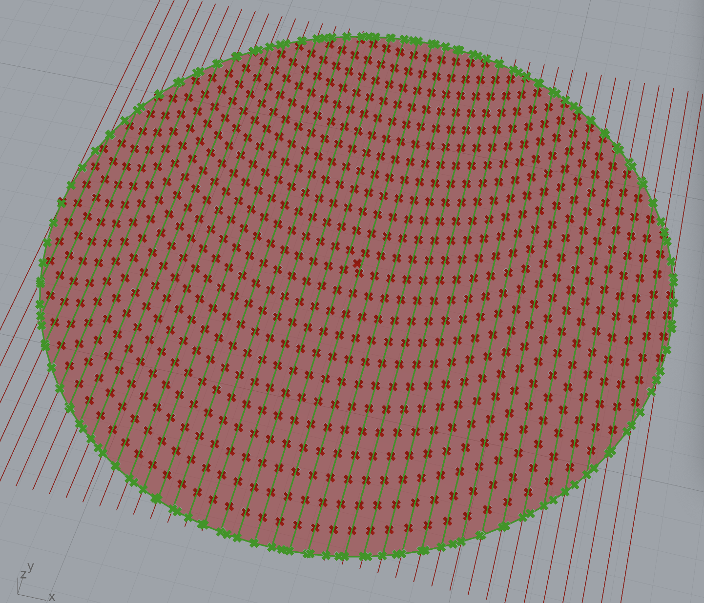
  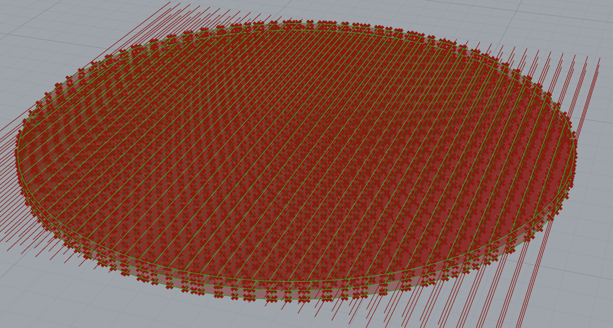
</p>

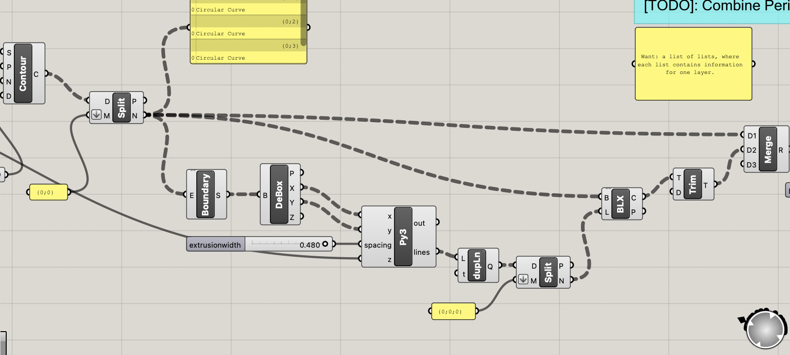

#### Task 2: Generating the g-code
The `gcode_move()` function when `extrude == True` is displayed below.
This function computes the length `L1` of filament that should be fed into the printer when traversing from point a to point b while extruding.

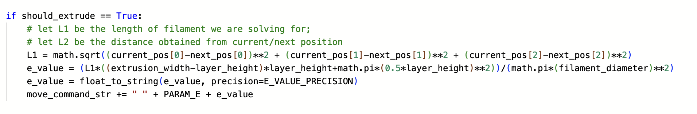

The `generate_gcode()` function `TODO`s are displayed below.
The parts added are 1) the move command to change Z position, 2) generating move commands for all line movements while extruding, and 3) appending these lines to the total command list, along with the start and end commands.

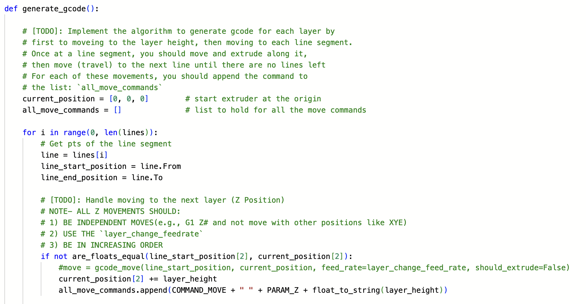
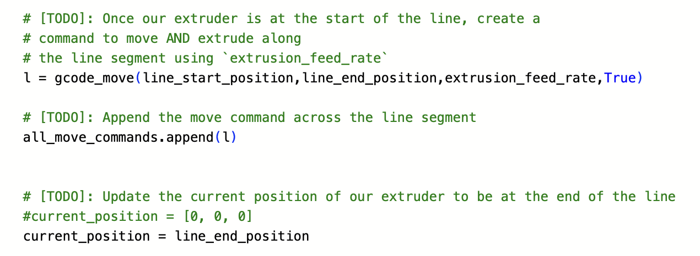
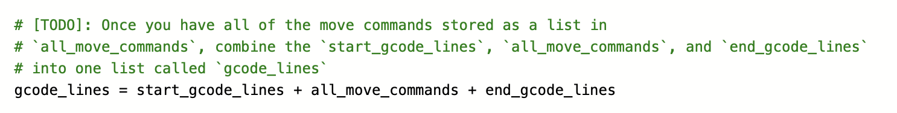

Below is a snippet of the generated g-code.

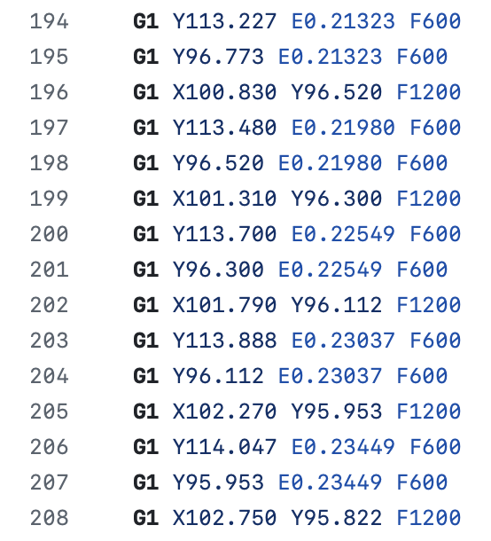

#### Task 3: Saving and testing the g-code
The g-code outputted by the Python script in Task 2 can be viewed [here](https://github.com/melodyhsu47/CompFab-2025/blob/main/output.gcode).
Below is a screenshot of the Prusa Gcode tester output.

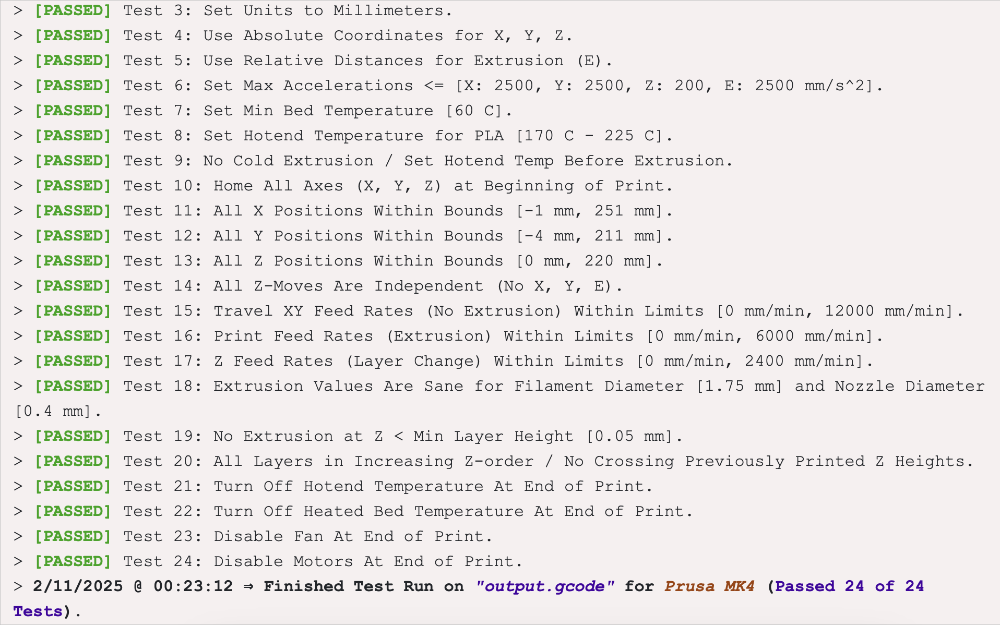

### Part 2
The Grasshopper code for the hexagonal and concentric infill can be found [here](https://github.com/melodyhsu47/CompFab-2025/blob/main/ExtraCreditHex_Concentric_Melody_L3slicer.gh); the Grasshopper code for the Hilbert curve infill can be found [here](https://github.com/melodyhsu47/CompFab-2025/blob/main/ExtraCreditHilbert_Melody_L3slicer.gh).

Below are images of the Prusa-sliced cylinder compared with the custom-sliced cylinder.
The Prusa-sliced cylinder is clearly the superior one; the custom-sliced cylinder probably spaced the lines too close together.

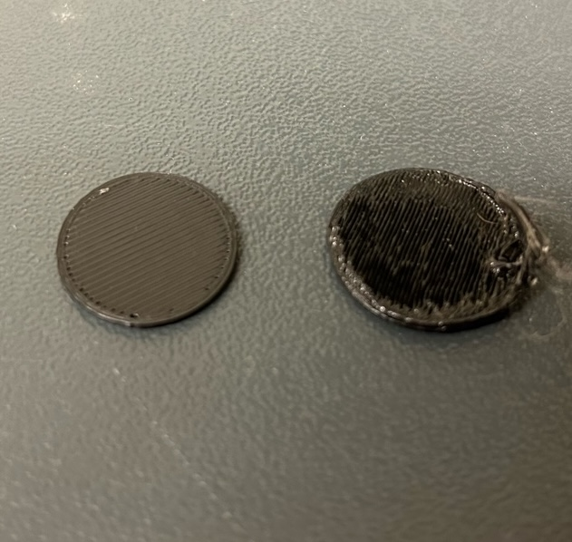

#### Extra Credit: Custom infill patterns
Below are examples of custom infill patterns: from left to right, we have concentric, honeycomb, and Hilbert curve.
The concentric infill was generated by using a series in conjunction with an Offset component; the honeycomb infill was generated using a Hexagonal Grid component; and the Hilbert curves were generated in Python using an implementation of an L-system. 

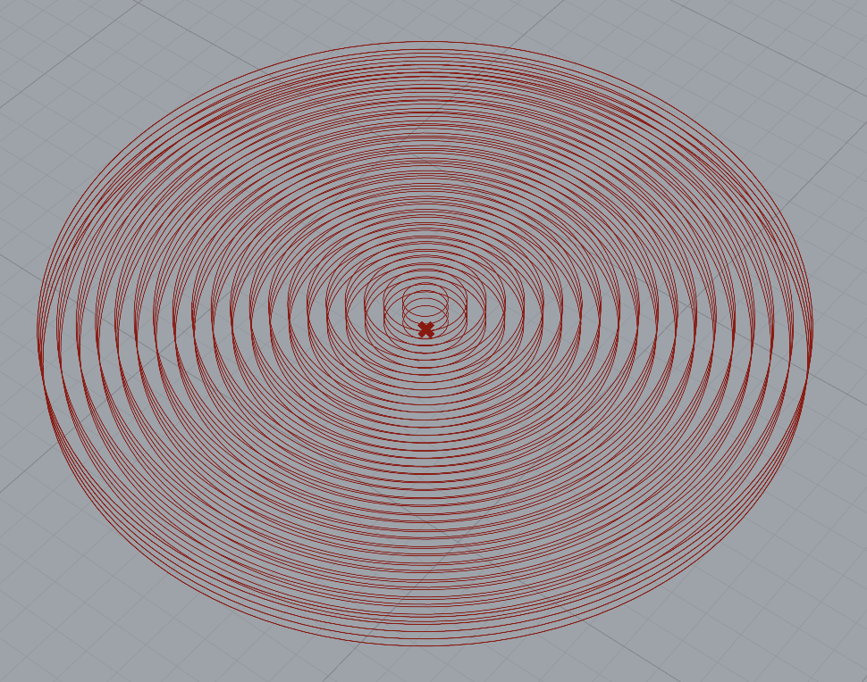
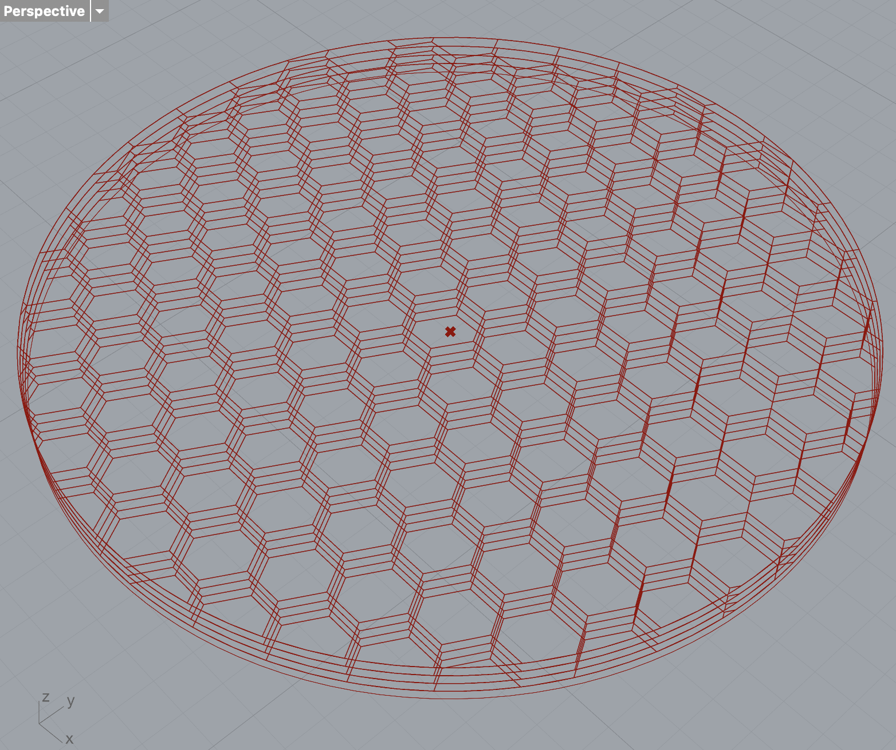
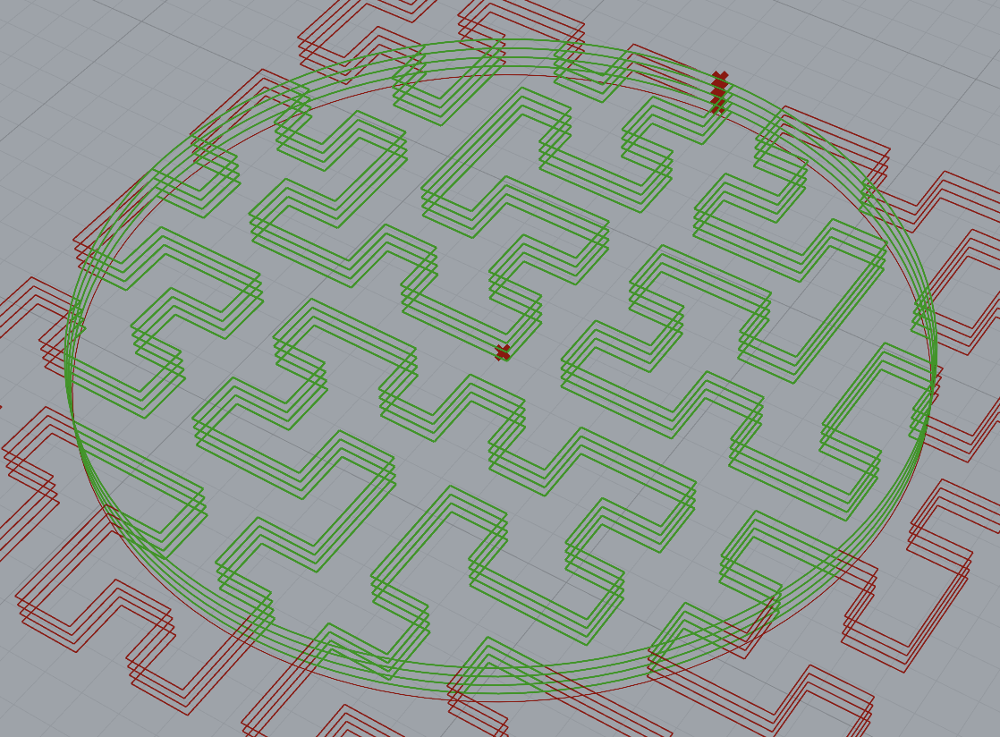

Examples of the hex and hilbert were also fabricated:

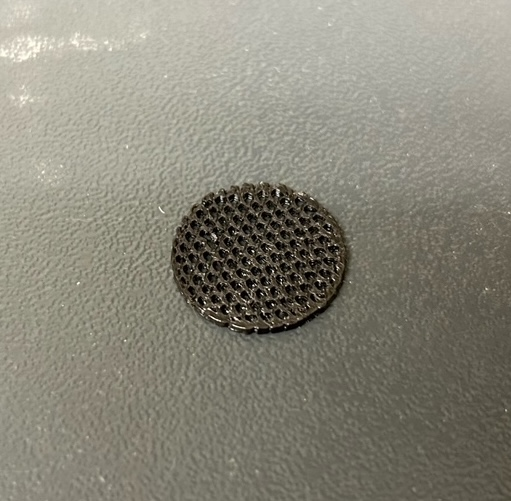
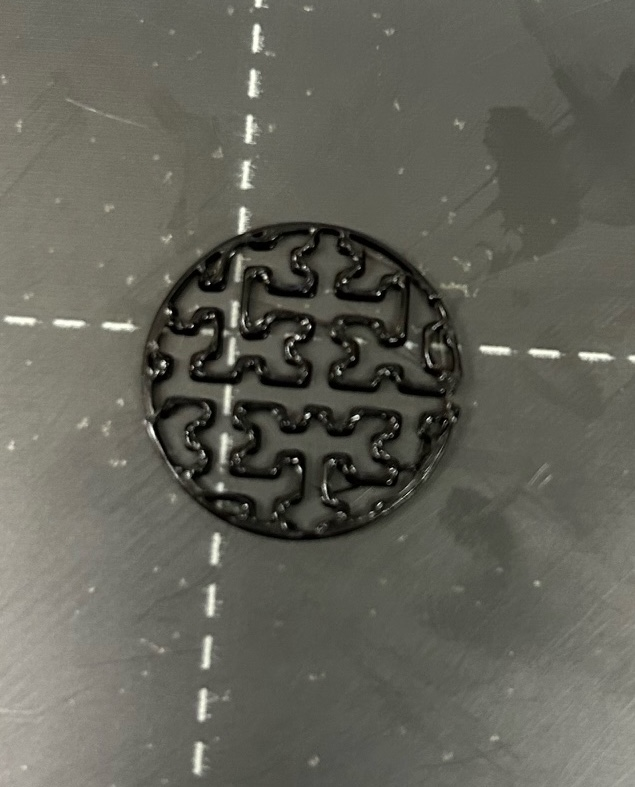


