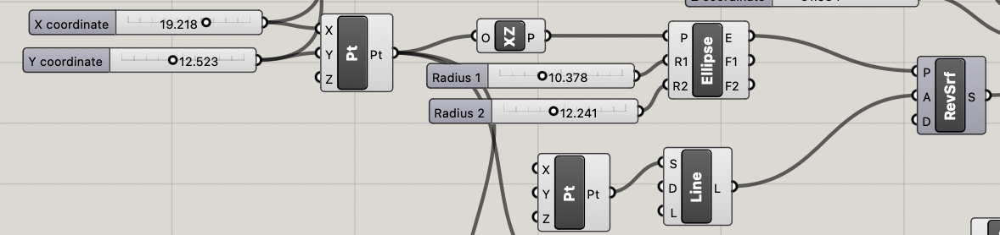
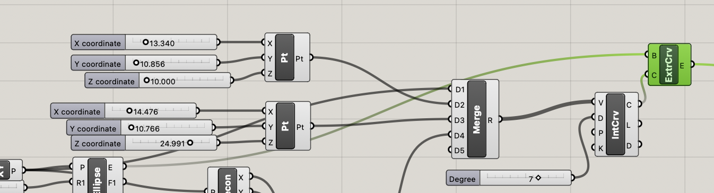
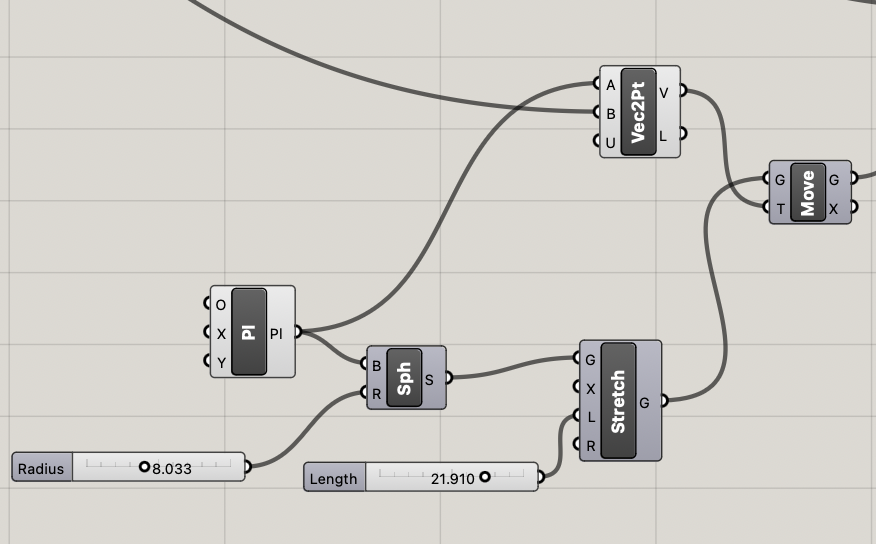
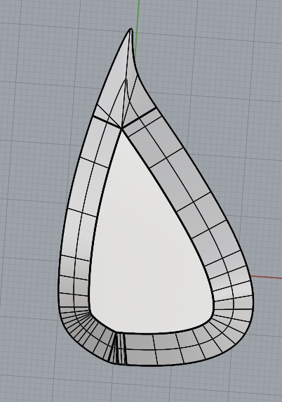
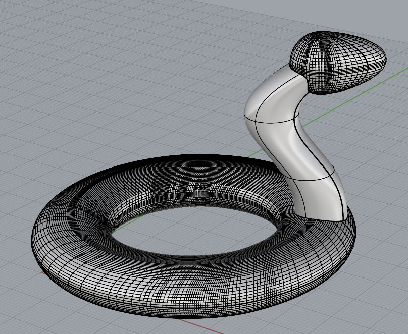
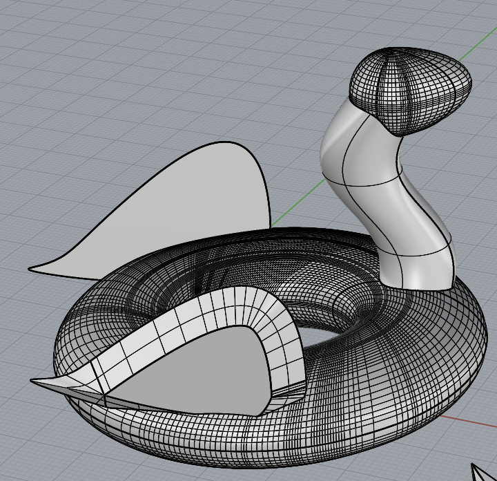
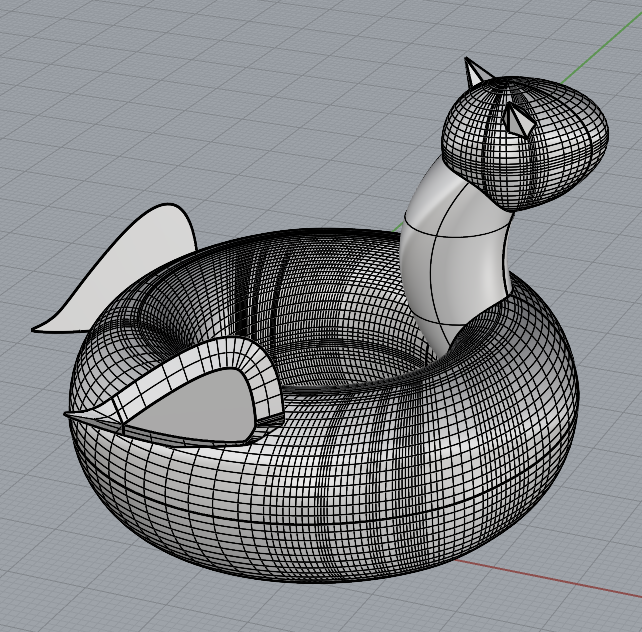

### Task 1: Generating Parametric Objects in Rhino/Grasshopper
The "furniture" that I took inspiration from for this project is a pool floaty "swan" that I own.
The main parametrized components include:
- The points of the curve through which the neck is interpolated;
- The size and sharpness of the face/snout;
- The size, height, roundness, and thickness of the base ring, including the outer/inner radii of the torus as well as the torus thickness itself.

The overall shape is made by taking a boolean union of the three main components, which are described in further detail below.

#### Body
The body is formed by revolving an ellipse around the Z-oriented axis to create a torus.
The parameters that the user can control are the radii of the ellipse that is revolved, which control the width and size of the torus.

#### Neck
The neck is made by creating three custom points - one anchored at the base where the ellipse for forming the torus lives, and two points that can be adjusted to the user's preference.
Then, a curve is interpolated along these lines, and then an ellipse at the base point is extruded along the curve.

#### Head
The head is formed by a stretched sphere which is anchored at the top point of the neck.
The user can control the head size by adjusting the sphere's radius, as well as the length of the head by adjusting the stretch length.

#### Non-parametric objects
Due to their complexity, the wings are non-parametric (i.e., generated fully in Rhino and non-adjustable by the user in Grasshopper).
The wings were a custom curve generated from control points that was then extruded/tapered. 

Not pictured are the horns are pyramids with a 6-sided base.

Below are three examples of this object generated in Rhino.
The first is the object with no custom non-parametric modifications; the next two include custom non-parametric modifications.

  
  
  

### Task 2: Fabricating Objects
Below are two examples of the fabricated objects.

