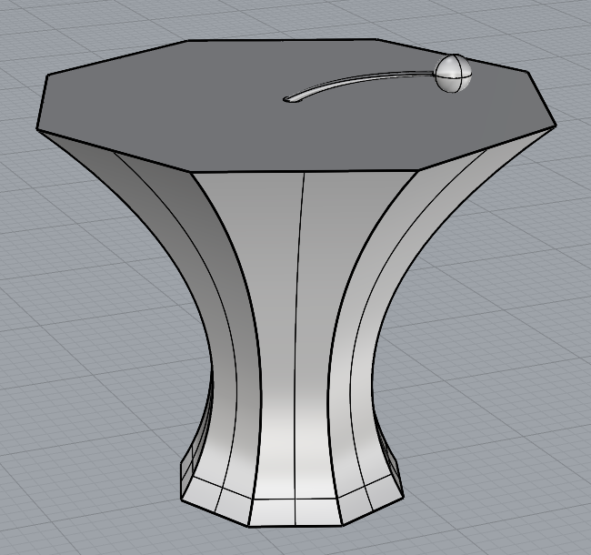
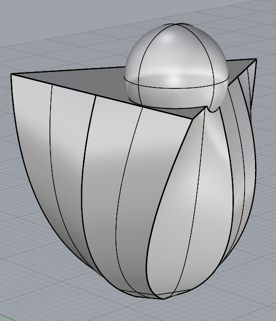

### Task 1: Generating Parametric Objects in Rhino/Grasshopper
The "furniture" that I took inspiration from for this project is a pool floaty "swan" that I own.
The main parametrized components include:
- The points of the curve through which the neck is interpolated;
- The size and sharpness of the face/snout;
- The size, height, roundness, and thickness of the base ring, including the outer/inner radii of the torus as well as the torus thickness itself.

#### Body
The body is formed by revolving an ellipse around the Z-oriented axis to create a torus.
The parameters that the user can control are the radii of the ellipse that is revolved, which control the width and size of the torus.

#### Neck
The neck is made by creating three custom points - one anchored at the base 

  
  

There are more finer-shaped objects which were a bit more difficult to parametrize, so these objects are hard-generated in Rhino.
This includes the wings and the horns; the wings were a custom curve generated from control points that was then extruded/tapered, and then the horns are pyramids with a 6-sided base.

Below are three examples of this object generated in Rhino:

### Task 2: Fabricating Objects
Below are two examples of the fabricated objects.
